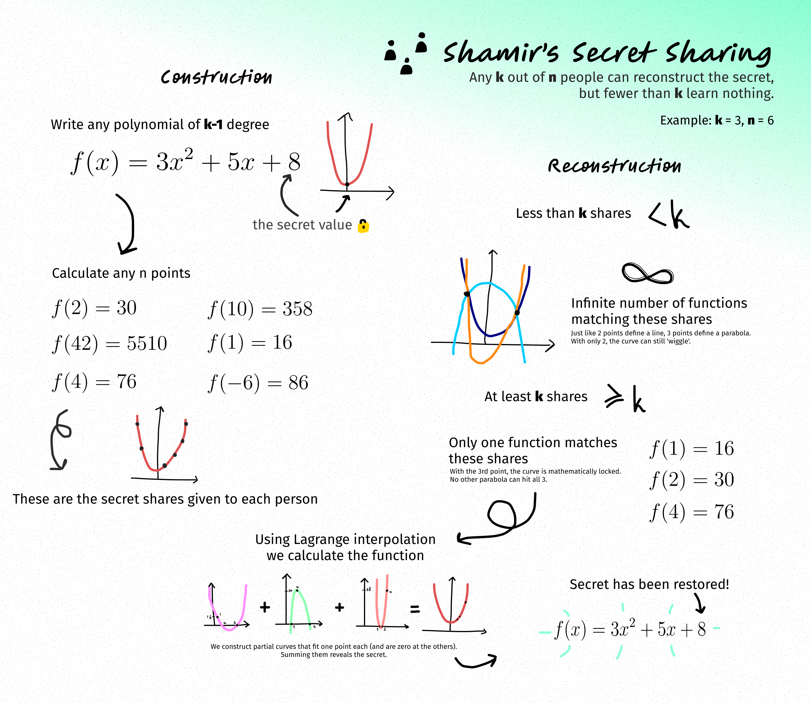

# Secret Sharing
This is a simple implementation of Shamir's Secret Sharing algorithm.

# Workings

Note:
This implementation uses modulo arithmetic for better security. The math is the same, but the results are modulo'd with a big prime number. The polynomial's coefficients and shares are generated randomly using Python's `secret` module.

# Usage
To make shares use the `make` command. For example, to generate 6 total shares with a threshold of 3 and a secret 42 you can use the following command.
```sh
$ python3 shamir.py make 6 3 42
=== Make ===
total_shares = 6
   threshold = 3
      secret = 42

Shares:
1,24707
2,48037
3,4495
4,25155
5,44480
6,62470
```

To reconstruct this secret use the `reconstruct` command like this.
```sh
$ python3 shamir.py reconstruct 3 --shares 1,24707 2,48037 3,4495
=== Reconstruct ===
threshold = 3

Shares:
1,24707
2,48037
3,4495

Secret:
42
```
The program will attempt (and fail) to generate secret even with the number of shares lower than k for the sake of presentation.
